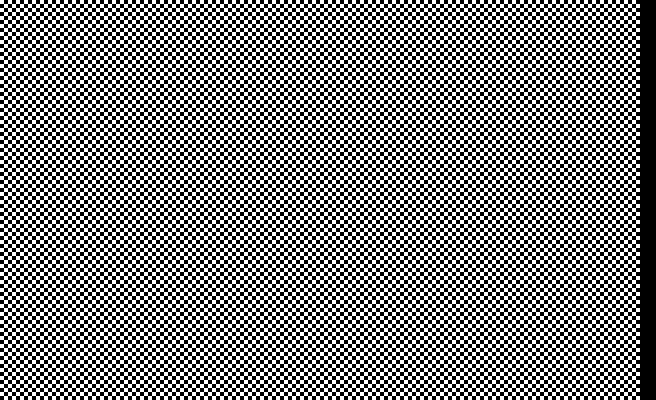

Lesson 1: A VGA controller
--------------------------

This is a simple VGA controller using 8 bits of color. 3 Bits of R, 3 Bits of G and 2 bits of B. 

The top level is in Lesson1.sv and this pulls in the MiSTer framework. It hooks up the scaler so that the VGA will work both on the VGA port if you have an I/O board, and on the HDMI.

vga.v is in the rtl folder, and it contains the timing information to make the pulses that VGA relies on.  This also has the logic to create the checker board pattern of black and white.


[](http://www.youtube.com/watch?v=81GN5DLCFOk "Lesson 1 Video")


# Step one build existing code

Load this project into quartus and build it. The RBF will be in the output_files folder, copy it to your MiSTer and see if you can run it.


# White checkerboard

If we change the r,g,b to be 8 pixels instead of 332 by concatenating the colors, then we can get a better color reproduction

```verilog
assign r = { pixel[7:5],  pixel[7:5] , pixel[7:6]};
assign g = { pixel[4:2],  pixel[4:2] , pixel[4:3]};
assign b = { pixel[1:0], pixel[1:0] , pixel[1:0],pixel[1:0] };
```



# Modification

Let's modify the code so that we can use a joystick to control the color of the squares.

We need to define wires for the joystick:
```verilog
wire [31:0] joy;
```
The format is like this:

bit 0: right
bit 1: left
bit 2: down
bit 3: up
bit 4+: buttons

We add two lines to the config, J1 tells it to label the first button "Red" and automatically map it to the "A" button on a SNES style joystick.
```verilog
	"J1,Red;",
	"jn,A;",
```

Add the first joystick to the hps_io:

```verilog
hps_io #(.STRLEN(($size(CONF_STR)>>3)) , .PS2DIV(1000), .WIDE(1)) hps_io
(
	.clk_sys(clk_sys),
	.HPS_BUS(HPS_BUS),
	.status(status),
	.joystick_0(joy),
	.conf_str(CONF_STR)
	
);
```

We need to check button 4, and if it is pressed, we can change the color to red, since we are in 332 RGB, then the first three bits should be 111 and the rest 0. If we want we can use this syntax with the underscores to make it more clear to read. The underscores are ignored.
```verilog
wire [7:0] color = joy[4] ? 8'b111_000_00 : 8'hFF;
```
we pass the color as an 8 bit wire to the vga controller and use it instead of the FF that is already in the code

```verilog
vga vga (
	 .color (color),
	 .pclk  (clk_sys),
	 .hs    (VGA_HS),
	 .vs    (VGA_VS),
	 .r     (VGA_R),
	 .g     (VGA_G),
	 .b     (VGA_B),
	 .VGA_DE(VGA_DE)
);
```

In vga.v:
```verilog
module vga (
   // pixel clock
   input  pclk,
	input  [7:0] color,
   // VGA output
   output reg	hs,
   output reg 	vs,
   output [7:0] r,
   output [7:0] g,
   output [7:0] b,
	output VGA_DE
);
```

```verilog
		pixel <= (v_cnt[2] ^ h_cnt[2])?8'h00:color;    // checkboard
```


